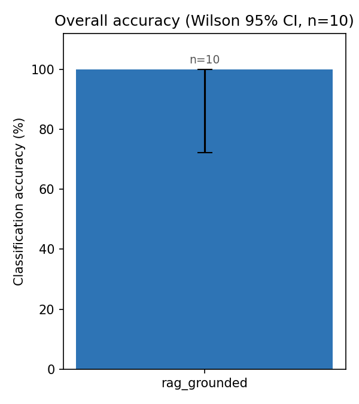
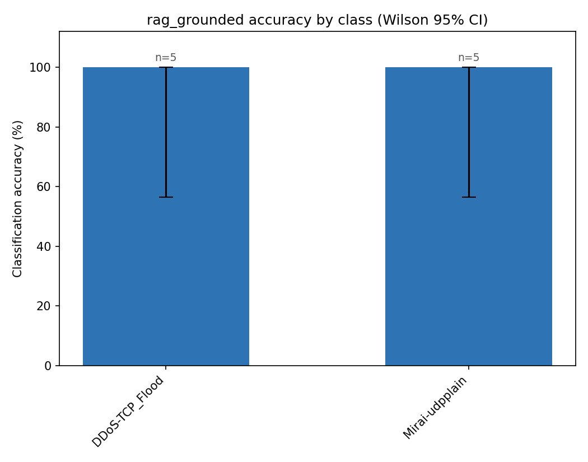
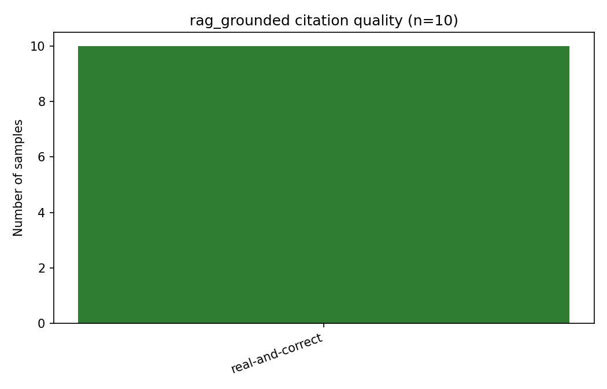

# RAG-Grounded Pilot

**Samples:** 10  
**Classes:** DDoS-TCP_Flood, Mirai-udpplain  
**Condition:** rag_grounded  

## Accuracy

Overall classification accuracy: **100.0% [72.2-100.0%] (n=10)**

| Class | Accuracy (Wilson 95% CI) | n |
|---|---|---|
| DDoS-TCP_Flood | 100.0% [56.6-100.0%] (n=5) | 5 |
| Mirai-udpplain | 100.0% [56.6-100.0%] (n=5) | 5 |

## Citation quality

| Grade | Count | Share |
|---|---|---|
| real-and-correct | 10 | 100.0% |

Real-and-correct rate: **100.0% [72.2-100.0%] (n=10)**

## Per-sample results

| sample_id | true_class | classification | reference_id | citation_grade |
|---|---|---|---|---|
| DDoS-TCP_Flood_0000 | DDoS-TCP_Flood | DDoS-TCP_Flood | CAPEC-482 | real-and-correct |
| DDoS-TCP_Flood_0001 | DDoS-TCP_Flood | DDoS-TCP_Flood | CAPEC-482 | real-and-correct |
| DDoS-TCP_Flood_0002 | DDoS-TCP_Flood | DDoS-TCP_Flood | CAPEC-482 | real-and-correct |
| DDoS-TCP_Flood_0003 | DDoS-TCP_Flood | DDoS-TCP_Flood | CAPEC-482 | real-and-correct |
| DDoS-TCP_Flood_0004 | DDoS-TCP_Flood | DDoS-TCP_Flood | CAPEC-482 | real-and-correct |
| Mirai-udpplain_0000 | Mirai-udpplain | Mirai-udpplain | CAPEC-486 | real-and-correct |
| Mirai-udpplain_0001 | Mirai-udpplain | Mirai-udpplain | CAPEC-486 | real-and-correct |
| Mirai-udpplain_0002 | Mirai-udpplain | Mirai-udpplain | CAPEC-486 | real-and-correct |
| Mirai-udpplain_0003 | Mirai-udpplain | Mirai-udpplain | CAPEC-486 | real-and-correct |
| Mirai-udpplain_0004 | Mirai-udpplain | Mirai-udpplain | CAPEC-486 | real-and-correct |

## Example justifications

**DDoS-TCP_Flood_0000** (real-and-correct): The traffic shows extremely high, bursty packet rates (up to ~75,000 pkt/s) with the protocol mix panel showing near-100% TCP throughout, indicating a volumetric TCP-based flood. The TCP flag panel shows sporadic spikes in SYN, ACK, and PSH fractions consistent with connection-state exploitation typical of TCP flooding. Packet size remains stable and small except for brief anomalies, further supporting a raw TCP flood rather than application-layer flooding.

**DDoS-TCP_Flood_0001** (real-and-correct): The traffic shows sustained high-volume packet rates (15,000-55,000 pkt/s) dominated almost entirely by TCP protocol, consistent with a TCP-based flooding attack. The TCP flag panel shows minimal SYN activity but presence of ACK/PSH/RST spikes, and packet sizes remain small and uniform (~60 bytes), typical of connection-state-exhausting TCP flood traffic as described in CAPEC-482.

**DDoS-TCP_Flood_0002** (real-and-correct): The traffic shows sustained high packet rates (10k-60k pkt/s) dominated almost entirely by TCP protocol, with a visible spike in SYN flag fraction around window 7, consistent with a TCP-based flooding attack. The small, uniform packet sizes (~60 bytes) further support a volumetric TCP flood exploiting connection-state handling as described in CAPEC-482.
